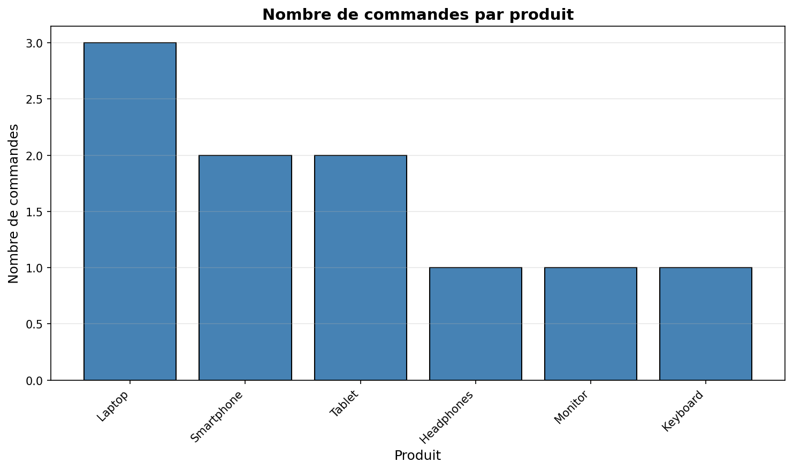
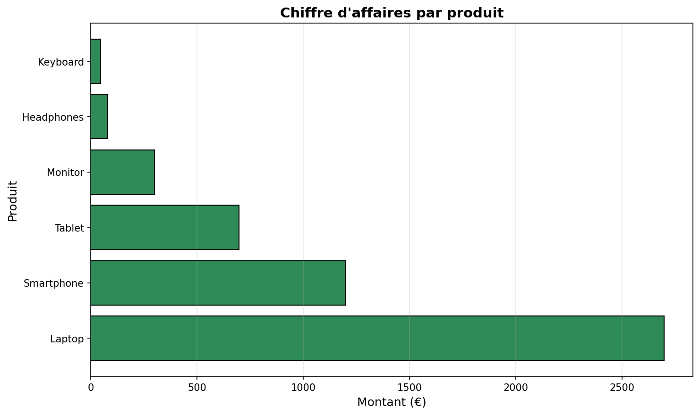
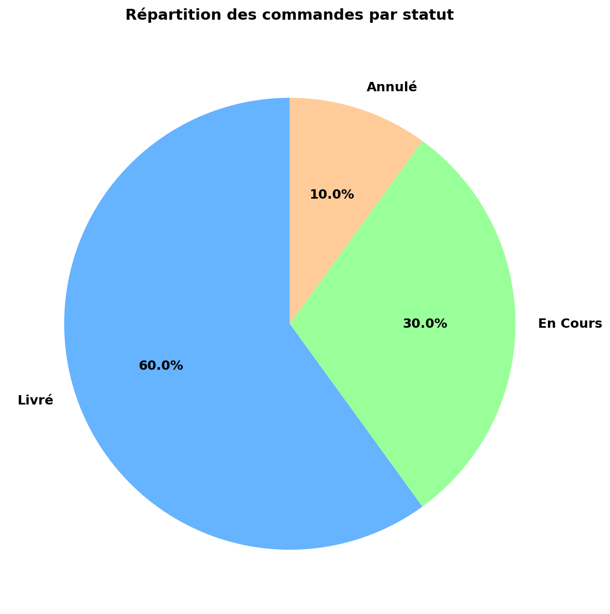

# 🛒 Projet Nettoyage de Données E-commerce

## 📋 Description

Projet d'analyse et de nettoyage de données e-commerce réalisé dans le cadre de mon portfolio Data Analyst. Ce projet démontre mes compétences en manipulation de données avec Python et Pandas.

## 🎯 Objectifs

- Nettoyer un dataset e-commerce contenant des erreurs typiques
- Standardiser les formats de données
- Produire un rapport avec visualisations
- Livrer un fichier propre exploitable

## 🔧 Technologies utilisées

- **Python 3.x**
- **Pandas** : Manipulation de données
- **Matplotlib** : Visualisations
- **Jupyter Notebook** : Environnement de développement

## 📊 Problèmes identifiés et corrigés

### Avant nettoyage (16 lignes)
- ✅ 1 ligne dupliquée
- ✅ 3 valeurs manquantes (noms clients, emails)
- ✅ Incohérences de format (majuscules/minuscules)
- ✅ 1 prix négatif (erreur de saisie)
- ✅ 1 quantité à 0 (invalide)
- ✅ Noms de produits non standardisés

### Après nettoyage (10 lignes)
- ✅ Données complètes et cohérentes
- ✅ Formats standardisés
- ✅ Valeurs valides uniquement

## 📂 Structure du projet
```
projet-ecommerce/
│
├── nettoyage_ecommerce.ipynb       # Notebook principal
├── ecommerce_sale.csv               # Données brutes
├── ecommerce_propre.csv             # Données nettoyées
├── graphique_commandes_produit.png  # Visualisation 1
├── graphique_ca_produit.png         # Visualisation 2
├── graphique_statut_commandes.png   # Visualisation 3
├── graphique_distribution_prix.png  # Visualisation 4
└── README.md                        # Documentation
```

## 🚀 Installation et utilisation

### Prérequis
```bash
pip install pandas matplotlib jupyter
```

### Exécution
```bash
jupyter notebook nettoyage_ecommerce.ipynb
```

## 📈 Résultats clés

- **Taux de nettoyage** : 37.5% de données problématiques supprimées
- **Montant total des ventes** : [Ton montant] €
- **Produit le plus vendu** : Laptop
- **Statut majoritaire** : Livré

## 📊 Visualisations

### 1. Commandes par produit


### 2. Chiffre d'affaires par produit


### 3. Répartition des statuts


### 4. Distribution des prix


## 🎓 Compétences démontrées

- Analyse exploratoire de données (EDA)
- Détection et correction d'anomalies
- Nettoyage de données (doublons, valeurs manquantes)
- Standardisation de formats
- Visualisation de données
- Documentation technique

## 📧 Contact

**NOAH TONTOLO**
- LinkedIn : Noah Tontolo
- Email : noahtontolo@gmail.com
- Portfolio : ComeUP, Malt, Fiver

## 📝 Licence

Ce projet est libre de droits et à but éducatif.

## 🔗 Autres projets

- [Analyse joueurs de football](https://github.com/[ton-username]/analyse-joueurs-football)
